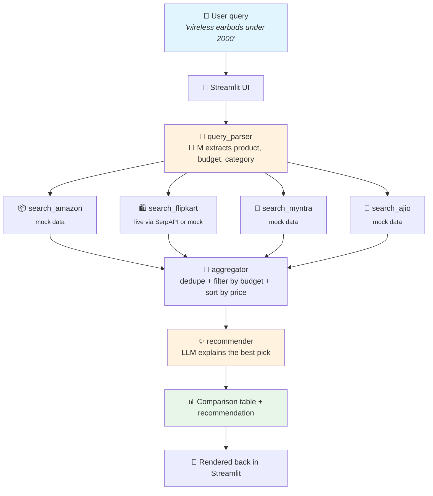

# 🛒 Ecom Price Agent

An AI shopping assistant that compares product prices across **Amazon**, **Flipkart**, **Myntra**, and **Ajio**, and recommends the best value pick. 💸

Built with **Streamlit** 🎈 (UI), **LangGraph** 🕸️ (agent orchestration), and a pluggable LLM backend — switch between **OpenAI** ☁️ and a **local Ollama** 🦙 model with one config flag, no code changes.

> 🚧 **Status:** Amazon, Myntra, and Ajio currently return **mock data** for fast local development. **Flipkart** can optionally pull **live prices** via SerpAPI — see [Real data sources](#-real-data-sources) below.

---

## 🧭 How it works



The four platform searches run **in parallel** inside the LangGraph graph — see [`agent/graph.py`](agent/graph.py) for the wiring and [`agent/state.py`](agent/state.py) for the shared state schema.

## 📁 Repo structure

```
ecom-price-agent/
├── app.py                       # 🎈 Streamlit entrypoint
├── agent/
│   ├── state.py                  # 🗂️  Shared LangGraph state (TypedDict)
│   ├── graph.py                    # 🕸️  StateGraph definition & compilation
│   ├── llm.py                        # 🔌 Pluggable LLM provider (OpenAI / Ollama)
│   ├── nodes/
│   │   ├── query_parser.py           # 🧠 free text -> structured filters
│   │   ├── search_amazon.py          # 📦 mock data
│   │   ├── search_flipkart.py        # 🛍️ live (SerpAPI) or mock, auto-fallback
│   │   ├── search_myntra.py          # 👗 mock data
│   │   ├── search_ajio.py            # 👕 mock data
│   │   ├── aggregator.py             # 🔀 dedupe, filter, rank by price
│   │   └── recommender.py            # ✨ LLM explains the best pick
│   └── tools/
│       ├── mock_products.py          # 🧪 stub product catalog
│       └── serpapi_flipkart.py       # 🌐 real Flipkart data via SerpAPI
├── tests/
│   ├── test_aggregator.py
│   └── test_serpapi_flipkart.py
├── .env.example
├── requirements.txt
├── .gitignore
└── README.md
```

## ⚙️ Setup

### 1️⃣ Clone and install

```bash
git clone <your-repo-url>
cd ecom-price-agent
python -m venv venv
source venv/bin/activate   # Windows: venv\Scripts\activate
pip install -r requirements.txt
```

### 2️⃣ Configure your LLM provider

Copy the example env file:

```bash
cp .env.example .env
```

**Option A — 🦙 Local Ollama** (default, no API key needed):

```env
LLM_PROVIDER=ollama
OLLAMA_MODEL=llama3
OLLAMA_BASE_URL=http://localhost:11434
```

Install Ollama (https://ollama.com), then pull a model:

```bash
ollama pull llama3
ollama serve   # usually starts automatically after install
```

Any Ollama-supported model works — try `llama3.1`, `mistral`, or `qwen2.5` and update `OLLAMA_MODEL` accordingly.

**Option B — ☁️ OpenAI** (when you have a working API key):

```env
LLM_PROVIDER=openai
OPENAI_API_KEY=sk-...
OPENAI_MODEL=gpt-4o-mini
```

You can also switch providers live from the **sidebar dropdown** in the app — it overrides the `.env` setting for that session. 🔄

### 3️⃣ Run the app

```bash
streamlit run app.py
```

---

## 🌐 Real data sources

| Platform | Status | Notes |
|---|---|---|
| 🛍️ Flipkart | ✅ Live (optional, keyless by default) | Default: [DuckDuckGo HTML search](https://html.duckduckgo.com/html/) filtered with `site:flipkart.com` — **no API key needed**, prices best-effort parsed from result text. Optional: [SerpAPI](https://serpapi.com) plain Google Search for a more polished (but key-required) alternative. Falls back to mock data automatically if either fails. |
| 📦 Amazon | 🧪 Mock | Requires Amazon Associates + PA-API approval, which needs qualifying sales — apply when ready. |
| 👗 Myntra | 🧪 Mock | No public product-search API. Options: paid aggregator, or a scraper (⚠️ against ToS — educational use only, cache + rate-limit). |
| 👕 Ajio | 🧪 Mock | Same situation as Myntra. |

### Choosing a Flipkart data source

```env
# duckduckgo (default) - keyless, scrapes DuckDuckGo HTML results
# serpapi               - more structured, requires SERPAPI_KEY
# mock                  - always use local mock data
FLIPKART_DATA_SOURCE=duckduckgo
SERPAPI_KEY=your_serpapi_key_here   # only needed if FLIPKART_DATA_SOURCE=serpapi
```

That's it — [`search_flipkart.py`](agent/nodes/search_flipkart.py) reads `FLIPKART_DATA_SOURCE` and routes to [`duckduckgo_flipkart.py`](agent/tools/duckduckgo_flipkart.py) or [`serpapi_flipkart.py`](agent/tools/serpapi_flipkart.py) accordingly; if the call fails or returns nothing usable for any reason (network, blocked request, no price-bearing snippets), it logs a warning in the UI and silently falls back to mock data so the app never breaks.

> ⚠️ **A note on the keyless approach:** DuckDuckGo's HTML endpoint has no API key or documented rate limit, which is exactly why it's handy for a scaffold/personal project — but it's still scraping a search results page rather than calling a sanctioned API. Expect occasional noise (missing prices, stale snippets) and don't lean on it for production-scale traffic. SerpAPI is the sturdier option if this project grows beyond personal use.

### Adding a new real platform

Keep the same output schema (`title`, `price`, `url`, `platform`, `rating`) so [`aggregator.py`](agent/nodes/aggregator.py) and [`recommender.py`](agent/nodes/recommender.py) don't need to change:

1. Add a client in `agent/tools/` (e.g. `serpapi_myntra.py`).
2. Update the matching `search_*_node` in `agent/nodes/` to call it, with a fallback to mock data on failure (copy the Flipkart node's pattern).
3. Add a `USE_REAL_<PLATFORM>` flag to `.env.example`.

## 🧪 Testing

```bash
pytest tests/
```

## 🗺️ Roadmap

- [x] LangGraph agent skeleton with mock data
- [x] Pluggable OpenAI / Ollama LLM backend
- [x] Live Flipkart data via SerpAPI
- [ ] Live Amazon data (PA-API)
- [ ] Live Myntra / Ajio data
- [ ] Response caching to cut LLM + API costs
- [ ] Product image thumbnails in the comparison table
